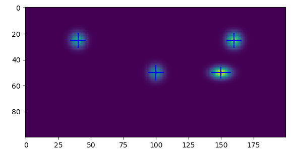

BLOBs
=====

[Home](https://github.com/mdavidsaver/blobs)

Analysis of gray scale images containing gaussian shaped blobs.
Blobs should not overlap in 2d, but may overlap in projection.
Entry point is `blobs.find_blobs()`.

```py
from blobs import find_blobs
from blobs.util import make_image, show_features
shape = (100, 200) # 200x100
Fs = [
    #  X   Y  W  H  A    IDX (ignored as input, unique in output)
    (160, 25, 4, 4, 4,   0),
    (150, 50, 5, 3, 5,   0),
    ( 40, 25, 4, 4, 3,   0),
    (100, 50, 4, 4, 2.5, 0),
]
print('Actual')
print(Fs)
img = make_image(shape, Fs, dtype='u1')
features = find_blobs(img)
print('Computed (order may differ)')
print(features)
show_features(img, features, sigma=3)
```


