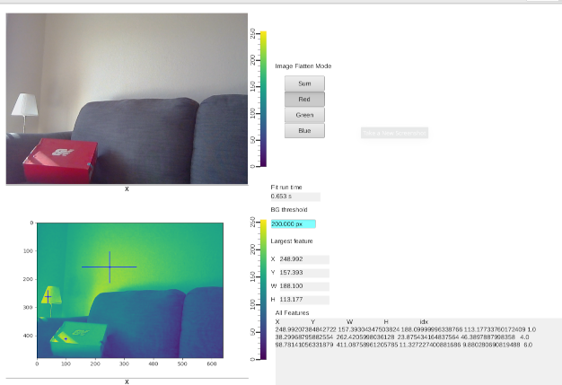

Live Processing with EPICS and PVA
==================================

The `live.py` script demonstrates realtime image processing with [image_blobs](../README.md)
using data received with a [PVAccess](https://mdavidsaver.github.io/p4p/overview.html#what-is-pvaccess) network client.
The script runs a PVAccess server to accept fit control settings (eg. background threshold) and to publish results.

The input image [PV](https://mdavidsaver.github.io/p4p/overview.html#what-is-a-pv) should conform to NTNDArray,
such as those served by the NDPluginPva plugin included with [areaDetector](https://areadetector.github.io/master/index.html).

Demo
----

Testing on Linux with webcam images served from [p4pvid](https://github.com/mdavidsaver/p4pvid).
UI the included `live-demo.bob` using [cs-studio/phoebus](https://control-system-studio.readthedocs.io/en/latest/) Display Builder.

Three "blobs" are detected on the Red channel above a background of 200 pixels.
Effective update rate of the result is ~0.5 Hz (running on a personal laptop).
